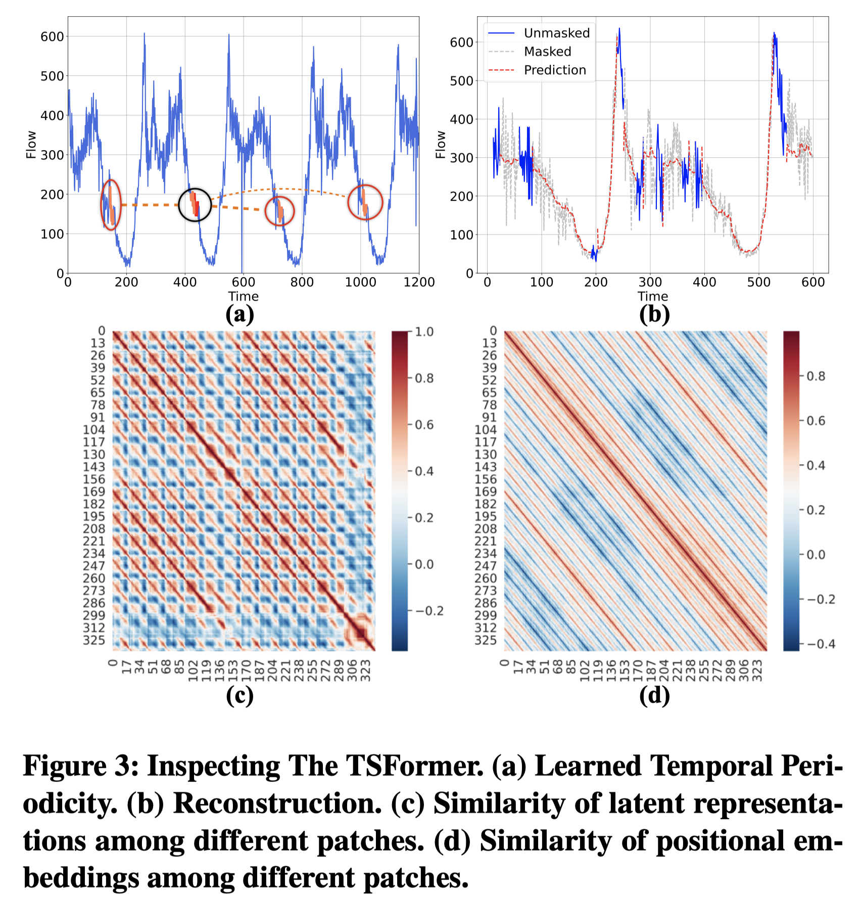

# Pre-training-Enhanced Spatial-Temporal Graph Neural Network For Multivariate Time Series Forecasting
Code for our paper Pre-training-Enhanced Spatial-Temporal Graph Neural Network For Multivariate Time Series Forecasting.

## 1. Data Preparation
### 1.1 Download Data
Download data from anonymous link [Google Drive](https://drive.google.com/drive/folders/1F7fEdXpnEQ75sxQval52jN4r3ZKoufGV?usp=sharing) or [BaiduYun](https://pan.baidu.com/s/1pRRbAi4DpjMVLMYvOsCZtA?pwd=w1wJ) to the code root directory.

Then, unzip data by:

```bash
unzip TSFormer_CKPT.zip
mkdir datasets
unzip raw_data.zip -d datasets
unzip sensor_graph.zip -d datasets 
rm *.zip
```
`TSFormer_CKPT/` contains the pretrained model for each dataset and the training log of the pretraining stage and forecasting stage.

### 1.2 Data Process
```bash
python datasets/raw_data/$DATASET_NAME/generate_data.py
```
Replace `$DATASET_NAME` with one of `METR-LA`, `PEMS-BAY`, `PEMS04`.

The processed data is placed in `datasets/$DATASET_NAME`.

## 2. Run based on a Pretrained TSFormer
```bash
python train_METR_FullModel.py --gpu='0,1'
```
```bash
python train_PEMS04_FullModel.py --gpu='0,1'
```
```bash
python train_PEMSBAY_FullModel.py --gpu='0,1'
```
`config/$DATASET_NAME/fullmodel_1x_gpu.py` describes the forecasting configurations.

We use 2 GPU as default, edit `GPU_NUM` property in the config file and `--gpu` in the command line to run on your own hardware.

Note that different GPU numbers lead to different real batch sizes, affecting the learning rate setting and the forecasting accuracy.

Our training logs are shown in `TSFormer_CKPT/Backend_metr.log`, `TSFormer_CKPT/Backend_pems04.log`, and `TSFormer_CKPT/Backend_pemsbay.log`.

## 3. Training from Scratch

### 3.1 Pretraining Stage
```bash
python train_METR_TSFormer.py --gpu='0'
```

```bash
python train_PEMS04_TSFormer.py --gpu='0, 1'
```

```bash
python train_PEMSBAY_TSFormer.py --gpu='0, 1, 2, 3, 4, 5, 6, 7'
```
`config/$DATASET_NAME/tsformer_1x_gpu.py` describes the forecasting configurations.

Edit the `BATCH_SIZE` and `GPU_NUM` in config file and `--gpu` in the command line to run on your own hardware.

### 3.2 Forecasting Stage
Move your pretrained model checkpoints to `TSFormer_CKPT/`.
For example:
```bash
cp checkpoints/TSFormer_200/9b4b52e25a30aabd21dc1c9429063196/TSFormer_180.pt TSFormer_CKPT/TSFormer_pemsbay.pt
```
```bash
cp checkpoints/TSFormer_200/fac3814778135a6d46063e3cab20257c/TSFormer_147.pt TSFormer_CKPT/TSFormer_pems04.pt
```
```bash
cp checkpoints/TSFormer_200/3de38a467aef981dd6f24127b6fb5f50/TSFormer_030.pt TSFormer_CKPT/TSFormer_metr.pt
```
Then train the downstream STGNN (Graph WaveNet) like in section 2.

## 4. Performance
<!--  -->


