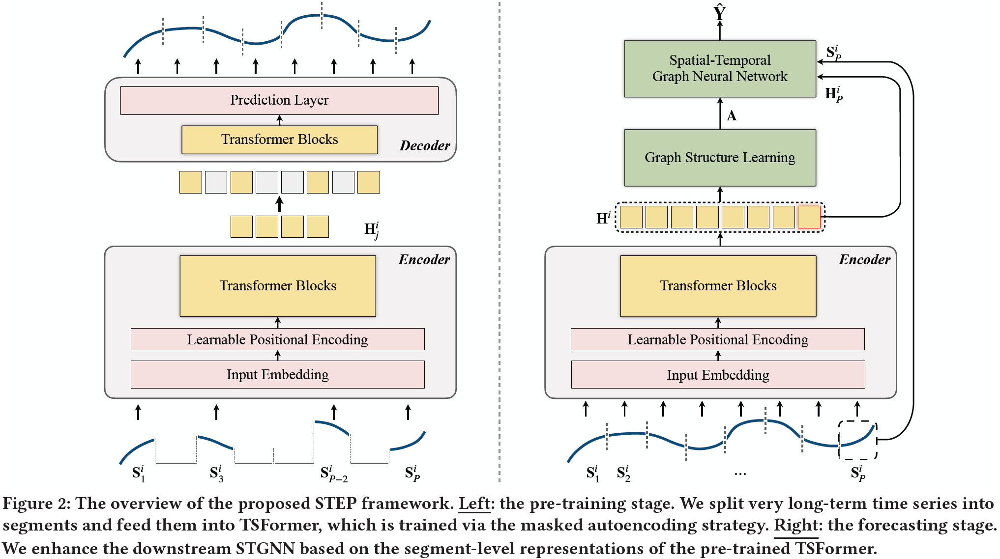
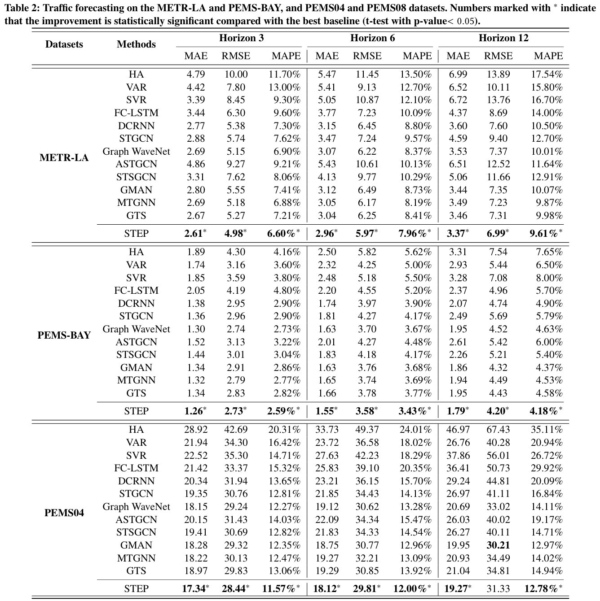
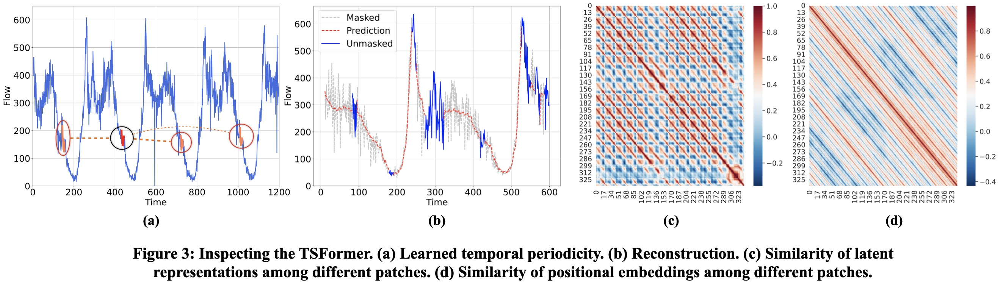

# <div align="center"> Pre-training-Enhanced Spatial-Temporal Graph Neural Network For Multivariate Time Series Forecasting </div>

<div align="center">

[](https://github.com/zezhishao/BasicTS)
[](https://github.com/cnstark/easytorch)
[](https://github.com/zezhishao/BasicTS/blob/master/LICENSE)

Code for our SIGKDD'22 paper: "[Pre-training-Enhanced Spatial-Temporal Graph Neural Network For Multivariate Time Series Forecasting](https://arxiv.org/abs/2206.09113)".

The code is developed with [BasicTS](https://github.com/zezhishao/BasicTS), a PyTorch-based benchmark and toolbox for time series forecasting.

</div>




> Multivariate Time Series (MTS) forecasting plays a vital role in a wide range of applications. Recently, Spatial-Temporal Graph Neural Networks (STGNNs) have become increasingly popular MTS forecasting methods. STGNNs jointly model the spatial and temporal patterns of MTS through graph neural networks and sequential models, significantly improving the prediction accuracy. But limited by model complexity, most STGNNs only consider short-term historical MTS data, such as data over the past one hour. However, the patterns of time series and the dependencies between them (i.e., the temporal and spatial patterns) need to be analyzed based on long-term historical MTS data. To address this issue, we propose a novel framework, in which STGNN is Enhanced by a scalable time series Pre-training model (STEP). Specifically, we design a pre-training model to efficiently learn temporal patterns from very long-term history time series (e.g., the past two weeks) and generate segment-level representations. These representations provide contextual information for short-term time series input to STGNNs and facilitate modeling dependencies between time series. Experiments on three public real-world datasets demonstrate that our framework is capable of significantly enhancing downstream STGNNs, and our pre-training model aptly captures temporal patterns.

## 📚 Table of Contents

```text
basicts   --> The BasicTS, which provides standard pipelines for training MTS forecasting models. Don't worry if you don't know it, because it doesn't prevent you from understanding STEP's code.

datasets  --> Raw datasets and preprocessed data

figures   --> Some figures used in README.

scripts   --> Data preprocessing scripts.

step      --> The implementation of STEP, including the architecture, dataloader, loss, and runner for STEP.

tsformer_ckpt --> Pre-trained TSFormer for METR-LA, PEMS-BAY, and PEMS04 dataset.

training_logs --> Training logs of STEP and TSFormer.

```

## 💿 Requirements

The code is built based on Python 3.9, PyTorch 1.10.0, and [EasyTorch](https://github.com/cnstark/easytorch).
You can install PyTorch following the instruction in [PyTorch](https://pytorch.org/get-started/locally/). For example:

```bash
pip install torch==1.10.0+cu111 torchvision==0.11.0+cu111 torchaudio==0.10.0 -f https://download.pytorch.org/whl/torch_stable.html
```

After ensuring that PyTorch is installed correctly, you can install other dependencies via:

```bash
pip install -r requirements.txt
```

## 📦 Data Preparation

### **Download Raw Data**

You can download all the raw datasets at [Google Drive](https://drive.google.com/file/d/1PY7IZ3SchpyXfNIXs71A2GEV29W5QCv2/view?usp=sharing) or [Baidu Yun](https://pan.baidu.com/s/1CXLxeHxHIMWLy3IKGFUq8g?pwd=blf8), and unzip them to `datasets/raw_data/`.

### **Pre-process Data**

You can pre-process all data via:

```bash
cd /path/to/your/project
bash scripts/data_preparation/all.sh
```

Then the `dataset` directory will look like this:

```text
datasets
   ├─METR-LA
   ├─METR-BAY
   ├─PEMS04
   ├─raw_data
   |    ├─PEMS04
   |    ├─PEMS-BAY
   |    ├─METR-LA
   ├─README.md
```

## <span id="jump"> 🎯 Train STEP based on a Pre-trained TSFormer </span>

```bash
python step/run.py --cfg='step/STEP_$DATASET.py' --gpus='0, 1'
# python step/run.py --cfg='step/STEP_METR-LA.py' --gpus='0, 1'
# python step/run.py --cfg='step/STEP_PEMS-BAY.py' --gpus='0, 1'
# python step/run.py --cfg='step/STEP_PEMS04.py' --gpus='0, 1'
```

Replace `$DATASET_NAME` with one of `METR-LA`, `PEMS-BAY`, `PEMS04` as shown in the code above. 
Configuration file `step/STEP_$DATASET.py` describes the forecasting configurations.
Edit `BATCH_SIZE` and `GPU_NUM` in the configuration file and `--gpu` in the command line to run on your own hardware.
Note that different GPU number leads to different real batch sizes, affecting the learning rate setting and the forecasting accuracy.

Our training logs are shown in [training_logs/STEP_METR-LA.log](./training_logs/STEP_METR-LA.log), [training_logs/STEP_METR-LA.log](./training_logs/STEP_METR-LA.log) and [training_logs/STEP_PEMS-BAY.log](./training_logs/STEP_PEMS-BAY.log).

## ⚒ Train STEP from Scratch

### **Pre-training Stage**

```bash
python step/run.py --cfg='step/TSFormer_$DATASET.py' --gpus '0'
# python step/run.py --cfg='step/TSFormer_METR-LA.py' --gpus='0'
# python step/run.py --cfg='step/TSFormer_PEMS-BAY.py' --gpus='0, 1'
# python step/run.py --cfg='step/TSFormer_PEMS04.py' --gpus='0, 1'
```

Replace `$DATASET_NAME` with one of `METR-LA`, `PEMS-BAY`, `PEMS04` as shown in the code above.
Configuration file `step/TSFormer_$DATASET.py` describes the pre-training configurations.
Edit the `BATCH_SIZE` and `GPU_NUM` in the configuration file and `--gpu` in the command line to run on your own hardware.

All the training logs, including the config file, training log, and checkpoints, will be saved in `checkpoints/MODEL_EPOCH/MD5_of_config_file`.
For example, `checkpoints/TSFormer_100/5afe80b3e7a3dc055158bcfe99afbd7f`.

Our training logs are shown in [training_logs/TSFormer_METR-LA.log](./training_logs/TSFormer_METR-LA.log), [training_logs/TSFormer_PEMS04.log](./training_logs/TSFormer_PEMS04.log), and [training_logs/TSFormer_PEMS04.log](./training_logs/TSFormer_PEMS-BAY.log), and the our pre-trained TSFormers for each datasets are placed in `tsformer_ckpt` folder.

### **Forecasting Stage**

After pre-training TSFormer, move your pre-trained best checkpoint to `tsformer_ckpt/`.
For example:

```bash
cp checkpoints/TSFormer_100/5afe80b3e7a3dc055158bcfe99afbd7f/TSFormer_best_val_MAE.pt tsformer_ckpt/TSFormer_$DATASET_NAME.pt
```

Replace `$DATASET_NAME` with one of `METR-LA`, `PEMS-BAY`, `PEMS04`.

Then train the downstream STGNN (Graph WaveNet) like in section ["🎯 Train STEP based on a Pre-trained TSFormer"](#jump).

## 📈 Performance and Visualization





## 🔗 More Related Works

- [D2STGNN: Decoupled Dynamic Spatial-Temporal Graph Neural Network for Traffic Forecasting. VLDB'22.](https://github.com/zezhishao/D2STGNN)

- [BasicTS: An Open Source Standard Time Series Forecasting Benchmark.](https://github.com/zezhishao/BasicTS)

## QA:

Q1: Why is the performance in the training log slightly different from the performance in the paper?

A1: 
STEP's code is now refactored based on [BasicTS](https://github.com/zezhishao/BasicTS), to provide fair comparisons with all baselines.
BasicTS unifies the training pipeline and evaluation metrics, which is slightly different from the original implementation of STEP.
Therefore, there may be small differences (better or worse) between training logs and papers that do not affect the conclusions of the paper.
Moreover, you can refer to BasicTS to find the true performance of many baseline models.

## Citing

If you find this repository useful for your work, please consider citing it as follows:

```bibtex
@inproceedings{DBLP:conf/kdd/ShaoZWX22,
  author    = {Zezhi Shao and
               Zhao Zhang and
               Fei Wang and
               Yongjun Xu},
  title     = {Pre-training Enhanced Spatial-temporal Graph Neural Network for Multivariate
               Time Series Forecasting},
  booktitle = {{KDD} '22: The 28th {ACM} {SIGKDD} Conference on Knowledge Discovery
               and Data Mining, Washington, DC, USA, August 14 - 18, 2022},
  pages     = {1567--1577},
  publisher = {{ACM}},
  year      = {2022}
}
```
